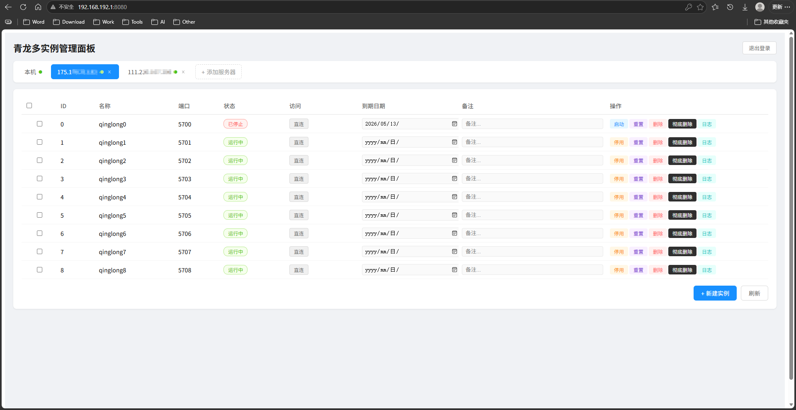

# Qinglong Panel

青龙多实例管理面板，用于在一台或多台服务器上批量管理青龙（qinglong）Docker 实例。支持本机 Docker（通过 Docker Socket）和远程服务器（通过 SSH）两种模式。

## 技术栈

| 层级 | 技术 |
|------|------|
| 前端 | Vue 3 + Vite + Axios |
| 后端 | Flask + Flask-JWT-Extended + Flask-SocketIO + Flask-CORS |
| 容器管理 | Docker SDK for Python（本机）、Paramiko（远程 SSH） |
| 反向代理 | Nginx（容器内静态资源 + API 代理，独立 Nginx 容器代理青龙实例） |

## 快速开始

### 1. 配置环境变量

```bash
cp .env.example .env
# 编辑 .env，修改账号、密码和密钥
```

### 2. 启动面板

```bash
docker compose up -d --build
```

### 3. 访问面板

```
http://服务器IP:8080
```

默认账号密码见 `.env` 文件（`PANEL_USERNAME` / `PANEL_PASSWORD`），部署前务必修改。

## 架构说明

单容器部署，Nginx + Flask 运行在同一个容器内：

- **Nginx** 监听 `80` 端口，负责前端静态资源和 `/api/`、`/socket.io/` 反向代理
- **Flask** 监听 `127.0.0.1:5000`，处理所有 API 请求
- Compose 对外暴露 `8080:80`
- 容器名固定为 `ql_manager`，用于 nginx 反向代理容器中的导航页回源

## 新建实例默认配置

通过面板新建青龙实例时，后端使用以下默认配置创建 Docker 容器：

| 配置项 | 实例 0（ql0） | 实例 1 ~ 100（qinglongN） |
|--------|--------------|--------------------------|
| **默认镜像** | `whyour/qinglong:debian-python3.10` | `whyour/qinglong:latest` |
| **CPU 限制** | 1 核（`nano_cpus=1000000000`） | 1 核（`nano_cpus=1000000000`） |
| **内存限制** | 1 GB（`mem_limit=1g`） | 1 GB（`mem_limit=1g`） |
| **容器名** | `ql0` | `qinglong1`, `qinglong2`, ... |
| **端口映射** | `5700:5700` | `5700+N:5700` |
| **数据目录** | `/home/docker/qinglong/ql0` → `/ql/data` | `/home/docker/qinglong/qinglongN` → `/ql/data` |
| **网络** | `ql_net`（bridge） | `ql_net`（bridge） |
| **重启策略** | `unless-stopped` | `unless-stopped` |
| **环境变量** | `QlBaseUrl=/ql0/`（如启用 nginx） | `QlBaseUrl=/qlN/`（如启用 nginx） |

> **镜像可通过环境变量覆盖**：`QL0_IMAGE` 控制实例 0 的镜像，`QL_IMAGE` 控制实例 1+ 的镜像。数据目录基础路径由 `QL_DATA_PATH` 控制，默认为 `/home/docker/qinglong`。

> **注意**：远程服务器（SSH 模式）创建的实例不设置 CPU/内存限制，且统一使用 `whyour/qinglong:latest` 镜像。

## 主要功能

- **JWT 登录认证**：失败次数限制（5 次错误锁定 300 秒）
- **多服务器管理**：默认包含"本机"服务器，可通过 SSH 添加远程服务器
- **实例全生命周期管理**：创建、启动、停止、重置、删除（保留数据）、彻底删除（含数据）
- **批量操作**：支持多选实例后批量启动、停止、重置、删除、彻底删除
- **实时日志查看**：通过 WebSocket（Socket.IO）获取容器日志
- **到期日期与备注**：表格内直接编辑到期日期和备注，到期实例红色高亮标记
- **Nginx 反向代理**：一键部署独立 Nginx 容器（端口 91），通过 `/qlN/` 子路径访问青龙面板
- **导航页**：Nginx 代理访问 `http://host:91/` 自动展示运行中的青龙实例列表
- **直连访问**：每个实例可直接通过 `http://host:5700+N/` 访问

## 访问方式

每个青龙实例支持两种访问方式：

| 方式 | URL 格式 | 说明 |
|------|---------|------|
| **代理访问** | `http://host:91/qlN/` | 需部署 Nginx 反向代理容器，实例需启用 nginx 选项 |
| **直连访问** | `http://host:5700+N/` | 直接访问容器端口，始终可用 |

> 实例 0（ql0）不使用 Nginx 代理，仅支持直连访问。

## 目录挂载

| 容器内路径 | 宿主机路径（默认） | 说明 |
|-----------|-------------------|------|
| `/var/run/docker.sock` | `/var/run/docker.sock` | Docker API 通信 |
| `/home/docker/qinglong` | `/home/docker/qinglong` | 青龙实例数据目录 |
| `/qlpanel/data` | `./data` | 面板数据（服务器列表、实例元数据） |
| `/home/docker/nginx` | `/home/docker/nginx` | Nginx 反向代理配置和日志 |

以上宿主机路径均可通过 `.env` 文件中的环境变量自定义。

## 环境变量

| 变量名 | 默认值 | 说明 |
|--------|--------|------|
| `PANEL_USERNAME` | `admin` | 面板登录用户名 |
| `PANEL_PASSWORD` | `change-me` | 面板登录密码 |
| `SECRET_KEY` | - | Flask Session 密钥 |
| `JWT_SECRET_KEY` | - | JWT 签名密钥 |
| `QL_IMAGE` | `whyour/qinglong:latest` | 实例 1+ 使用的镜像 |
| `QL0_IMAGE` | `whyour/qinglong:debian-python3.10` | 实例 0 使用的镜像 |
| `QL_DATA_PATH` | `/home/docker/qinglong` | 青龙数据目录（容器内路径） |
| `QL_HOST_DATA_PATH` | `/home/docker/qinglong` | 青龙数据目录（宿主机路径） |
| `PANEL_HOST_DATA_PATH` | `./data` | 面板数据目录（宿主机路径） |
| `NGINX_HOST_PATH` | `/home/docker/nginx` | Nginx 配置目录（宿主机路径） |

## 注意事项

- 面板需要挂载 `/var/run/docker.sock`，等同于赋予面板容器主机级别的 Docker 控制权限
- **不要直接暴露到公网**，至少应使用强密码、随机密钥，并放在可信网络或额外反向代理认证之后
- 远程 SSH 密码使用 Fernet 加密存储（密钥由 JWT_SECRET_KEY 派生）
- 彻底删除（purge）操作会同时删除容器和数据目录，不可恢复，请谨慎操作

## 截图

