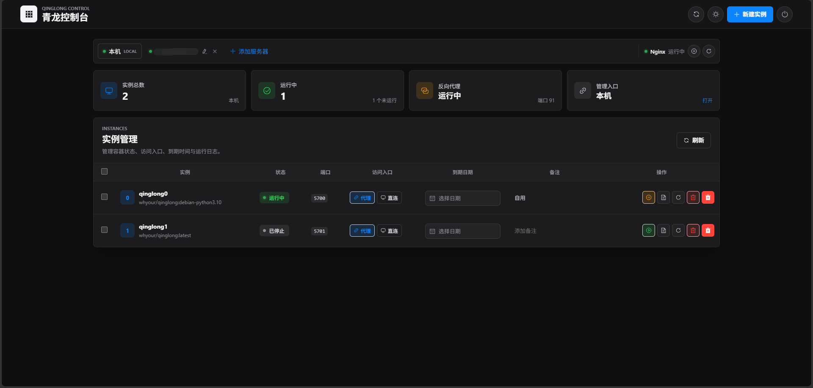

# Qinglong Management Panel

面向青龙 Docker 多实例的管理面板。一个 `ql_manager` 容器同时提供 Web UI、管理 API 和本机到期调度，可管理本机 Docker，也可通过 SSH 管理远程服务器。



## 功能概览

- 本机与远程服务器统一管理，支持编辑已保存的远程服务器配置
- 创建、启动、停止、重置、删除和彻底删除青龙实例
- 批量启动、停止、重置、删除与彻底删除
- 自定义镜像、CPU、内存、到期日期、备注和 Nginx 接入状态
- Apple 风格响应式界面，支持浅色/深色主题
- JWT 登录状态默认保持 30 天，过期后需要重新登录
- 容器日志查看和实例运行状态展示
- 本机实例到期自动停止，不需要额外的定时任务容器
- 本机及远程 Nginx 配置预览、部署、启动、停止和重启
- `/qlN/` 子路径反向代理，兼容未正确设置 `QlBaseUrl` 的历史实例

## 架构

项目本身只部署一个 Compose 服务：

```text
浏览器
  |
  |-- http://host/ 或 :8080
  v
ql_manager
  |-- Nginx :80          前端静态资源、API 与 WebSocket 代理
  |-- Flask :5000        登录、实例管理、远程 SSH、到期调度
  |-- Docker Socket      管理本机容器
  `-- ./data             服务器配置和实例元数据

独立 nginx（可选，默认 :91）
  `-- /ql0/、/ql1/ ...   反向代理到对应青龙容器
```

`ql_manager` 内部的 Python 线程负责每日到期检查，不会因此再创建一个 Docker 容器。独立 `nginx` 只用于青龙实例的 `/qlN/` 反向代理，不属于面板 Compose 服务。

## 部署要求

- Linux 服务器
- Docker Engine 和 Docker Compose v2
- 可用的宿主机端口 `80`、`8080`；需要反向代理时还需端口 `91`
- 一个名为 `ql_net` 的 bridge 网络
- 当前用户有执行 Docker 命令的权限
- 管理远程服务器时，目标机需要 Docker、SSH 服务以及可执行 Docker 的账号

## 快速部署

### 1. 准备配置

```bash
git clone https://github.com/justnoobone/QinglongManagementPanel.git
cd QinglongManagementPanel
cp .env.example .env
```

部署前至少修改以下四项：

```dotenv
PANEL_USERNAME=admin
PANEL_PASSWORD=使用强密码
SECRET_KEY=使用足够长的随机字符串
JWT_SECRET_KEY=使用另一个足够长的随机字符串
```

可用下面的命令生成随机密钥：

```bash
openssl rand -hex 32
```

### 2. 创建 Docker 网络

```bash
docker network inspect ql_net >/dev/null 2>&1 || docker network create ql_net
```

### 3. 构建并启动

```bash
docker compose up -d --build
```

### 4. 验证

```bash
docker compose ps
curl -fsS http://127.0.0.1/api/health
docker logs --tail 100 ql_manager
```

预期健康接口返回：

```json
{"status":"ok"}
```

访问地址：

- 主入口：`http://服务器IP/`
- 兼容入口：`http://服务器IP:8080/`

## 实例约定

面板识别 `qinglongN` 和历史名称 `qlN`，列表只展示编号 `0` 到 `100` 的实例，因此新建时必须使用该范围。新建实例统一使用 `qinglongN`。

| 项目 | 实例 0 | 实例 N |
| --- | --- | --- |
| 容器名 | `qinglong0` | `qinglongN` |
| 默认镜像 | `whyour/qinglong:debian-python3.10` | `whyour/qinglong:latest` |
| 宿主机端口 | `5700` | `5700 + N` |
| 容器端口 | `5700` | `5700` |
| 默认 CPU | 1 核 | 1 核 |
| 默认内存 | 1 GB | 1 GB |
| 默认数据目录 | `/home/docker/qinglong/qinglong0` | `/home/docker/qinglong/qinglongN` |
| 重启策略 | `unless-stopped` | `unless-stopped` |
| Docker 网络 | `ql_net` | `ql_net` |

启用 Nginx 时，新实例会写入大小写敏感的环境变量：

```text
QlBaseUrl=/qlN/
```

青龙不会识别 `QL_BASE_PATH` 作为等价配置。对于已有的旧容器，配置生成器会自动使用剥离 `/qlN/` 前缀的兼容代理模式，避免静态资源和 API 因路径错误而白屏。

## 访问青龙实例

| 方式 | 示例 | 条件 |
| --- | --- | --- |
| 直连 | `http://服务器IP:5701/` | 实例 1 正在运行且端口已放行 |
| 反向代理 | `http://服务器IP:91/ql1/` | 独立 Nginx 已部署，实例启用了代理 |
| 代理导航页 | `http://服务器IP:91/` | 独立 Nginx 正在运行 |

`/qlN` 会使用 `308` 自动补全为 `/qlN/`。浏览器访问时建议始终保留末尾斜杠。

## 到期自动停止

到期调度器直接运行在 `ql_manager` 的 Flask 进程中，默认使用北京时间每天 `00:05` 检查一次。进程在计划时间之后启动时，会在启动后补做当天检查。

规则如下：

1. 只检查状态为 `running` 的本机实例。
2. 到期日期等于当天时停止实例。
3. 到期日期早于当天时也停止实例，避免服务器关机或任务异常造成漏检。
4. 用户当天新保存一个已到期日期时，后端会立即执行检查，不等待第二天。
5. 过期实例禁止启动和重置，批量操作也不能绕过。
6. 过期后不能清空日期，也不能继续填写今天或过去日期；必须改成晚于今天的新日期才可重新启动。
7. 调度器只读取 `local:N` 元数据，不会通过 SSH、远程 API 或远程 Docker 停止其他服务器上的实例。

审计调度日志：

```bash
docker logs ql_manager 2>&1 | grep expiry_scheduler
```

手动执行只读预演，不会停止容器：

```bash
docker exec -w /qlpanel/backend ql_manager \
  python -c "from expiry_scheduler import run_expiry_check; print(run_expiry_check(dry_run=True))"
```

调度参数：

| 变量 | 默认值 | 有效范围 | 说明 |
| --- | --- | --- | --- |
| `TZ` | `Asia/Shanghai` | 时区名称 | 容器时区 |
| `EXPIRY_SCHEDULER_ENABLED` | `true` | `true/false` | 是否启用内置调度器 |
| `EXPIRY_CHECK_HOUR` | `0` | `0-23` | 每日检查小时 |
| `EXPIRY_CHECK_MINUTE` | `5` | `0-59` | 每日检查分钟 |
| `EXPIRY_CHECK_INTERVAL` | `30` | `10-3600` | 后台线程轮询间隔，单位秒 |

修改 `.env` 后需重建 `ql_manager` 使环境变量生效：

```bash
docker compose up -d --build --no-deps ql-panel
```

## 本机 Nginx 反向代理

面板可以管理一个名为 `nginx` 的独立容器，默认使用宿主机端口 `91`，配置保存在：

```text
/home/docker/nginx/conf.d/ql_panels.conf
```

在控制台选择本机后，可预览配置并部署、启动、停止或重启 Nginx。实例创建、删除或代理开关变化时，面板会重写配置并尝试 reload 正在运行的 Nginx。

常用检查：

```bash
docker exec nginx nginx -t
curl -I http://127.0.0.1:91/ql0/
curl -I http://127.0.0.1:91/ql1/
```

注意：本机 Nginx 的镜像和端口目前由后端常量定义，默认镜像为 `nginx:alpine`、端口为 `91`。界面中的镜像、端口和目录自定义部署主要用于远程服务器。

## 远程服务器与远程 Nginx

添加远程服务器时，面板会先使用 SSH 密码测试连接。保存后的密码使用由 `JWT_SECRET_KEY` 派生的 Fernet 密钥加密，配置写入面板数据目录。

远程 Nginx 推荐流程：

1. 添加或编辑远程服务器，确认 SSH 地址、端口、账号和青龙数据根目录。
2. 选择该服务器，进入 Nginx 配置界面。
3. 指定镜像、宿主机端口和持久化目录。
4. 先预览生成的配置。
5. 在维护窗口确认部署。

远程部署会执行以下操作：

- 拉取指定 Nginx 镜像
- 创建或检查 `ql_net`
- 将识别到的青龙容器接入 `ql_net`
- 使用候选配置执行 `nginx -t`
- 短暂停止并切换已有同名 Nginx 容器
- 新容器检查失败时尝试恢复旧容器

默认远程 Nginx 配置：

| 项目 | 默认值 |
| --- | --- |
| 镜像 | `nginx:1.29.7-alpine` |
| 宿主机端口 | `91` |
| 数据目录 | `/home/docker/nginx` |
| 容器名 | `nginx` |
| Docker 网络 | `ql_net` |

远程 Nginx 切换会产生数秒访问中断，应在维护窗口执行。面板的到期自动停止不作用于远程服务器，但用户主动点击的远程启动、停止、重置、删除和 Nginx 部署会立即通过 SSH 执行。

## 环境变量

| 变量 | 默认值 | 说明 |
| --- | --- | --- |
| `PANEL_USERNAME` | `admin` | 面板登录用户名 |
| `PANEL_PASSWORD` | `change-me` | 面板登录密码，生产环境必须修改 |
| `SECRET_KEY` | `change-this-secret-key` | Flask 密钥，生产环境必须修改 |
| `JWT_SECRET_KEY` | `change-this-jwt-secret-key` | JWT 及远程密码加密密钥，生产环境必须修改 |
| `QL_IMAGE` | `whyour/qinglong:latest` | 实例 1 及以上的默认镜像 |
| `QL0_IMAGE` | `whyour/qinglong:debian-python3.10` | 实例 0 的默认镜像 |
| `QL_DATA_PATH` | `/home/docker/qinglong` | 面板容器内的青龙数据根目录 |
| `QL_HOST_DATA_PATH` | `/home/docker/qinglong` | 宿主机青龙数据根目录 |
| `PANEL_HOST_DATA_PATH` | `./data` | 面板持久化数据目录 |
| `NGINX_HOST_PATH` | `/home/docker/nginx` | 本机独立 Nginx 持久化目录 |
| `DOCKER_HOST` | `unix:///host/run/docker.sock` | 面板连接宿主机 Docker 的 Socket |
| `TZ` | `Asia/Shanghai` | 面板和调度器时区 |
| `EXPIRY_SCHEDULER_ENABLED` | `true` | 是否启用本机到期调度 |
| `EXPIRY_CHECK_HOUR` | `0` | 每日检查小时 |
| `EXPIRY_CHECK_MINUTE` | `5` | 每日检查分钟 |
| `EXPIRY_CHECK_INTERVAL` | `30` | 后台轮询间隔，单位秒 |

## 持久化数据

| 容器路径 | 默认宿主机路径 | 内容 |
| --- | --- | --- |
| `/qlpanel/data` | `./data` | 服务器配置、加密密码、实例元数据和到期状态 |
| `/home/docker/qinglong` | `/home/docker/qinglong` | 青龙实例数据目录 |
| `/home/docker/nginx` | `/home/docker/nginx` | 本机独立 Nginx 配置与日志 |
| `/host/run` | `/run`，只读 | Docker Socket 所在父目录 |

挂载整个 `/run` 而不是单独挂载 `/var/run/docker.sock`，是为了避免 Docker daemon 重启后 `ql_manager` 继续持有已经失效的 Socket inode。

建议至少备份：

```bash
tar -czf qinglong-panel-backup.tgz ./data /home/docker/qinglong /home/docker/nginx
```

不要提交 `.env` 和 `data/`，它们已被 `.gitignore` 排除并可能包含敏感信息。

## 升级与回滚

升级前记录当前提交并备份持久化数据：

```bash
git rev-parse --short HEAD
tar -czf qinglong-panel-data-backup.tgz ./data
git pull --ff-only
docker compose up -d --build --no-deps ql-panel
curl -fsS http://127.0.0.1/api/health
```

回滚源码和面板容器：

```bash
git log --oneline -10
git checkout <已验证的提交>
docker compose up -d --build --no-deps ql-panel
```

只使用 `--no-deps ql-panel` 可以限定重建范围为面板容器，不会主动重建青龙实例或独立 Nginx。切换到旧提交前仍应检查数据格式兼容性。

## 测试

生产镜像中包含后端依赖，可使用隔离容器运行测试：

```bash
docker build -t qinglong-panel-ql-panel .
docker run --rm --entrypoint sh \
  -v "$PWD/backend:/test:ro" \
  qinglong-panel-ql-panel \
  -c 'cd /test && python -m unittest discover -p "test_*.py" -v'
```

前端生产构建包含在 `docker build` 中。若宿主机的 `frontend/node_modules` 权限或 Rollup 可选依赖异常，以干净 Docker 构建结果为准。

## 故障排查

### 面板显示本机没有实例

检查 Docker Socket 和实例命名：

```bash
docker exec ql_manager sh -c 'echo "$DOCKER_HOST"'
docker exec -w /qlpanel/backend ql_manager \
  python -c "from docker_manager import list_instances; print(list_instances())"
docker ps -a --format '{{.Names}}' | grep -E '^(qinglong|ql)[0-9]+$'
```

若 Docker daemon 重启后出现 `ConnectionRefusedError`，确认 Compose 仍挂载 `/run:/host/run:ro`，且 `DOCKER_HOST=unix:///host/run/docker.sock`，然后只重建面板：

```bash
docker compose up -d --force-recreate --no-deps ql-panel
```

### `/qlN/` 白屏

检查容器真实的 `QlBaseUrl`、代理配置和静态资源类型：

```bash
docker inspect qinglong0 --format '{{range .Config.Env}}{{println .}}{{end}}' | grep -E 'QlBaseUrl|QL_BASE_PATH'
docker exec nginx nginx -t
curl -I http://127.0.0.1:91/ql0/
```

只有 `QlBaseUrl` 大小写完全正确时，青龙才会原生识别子路径。旧实例无需仅为此问题重建，生成器会使用兼容代理模式。

### 到期任务没有执行

```bash
docker logs ql_manager 2>&1 | grep expiry_scheduler
docker exec ql_manager date
docker exec -w /qlpanel/backend ql_manager \
  python -c "from expiry_scheduler import run_expiry_check; print(run_expiry_check(dry_run=True))"
```

确认 `.env` 中未关闭 `EXPIRY_SCHEDULER_ENABLED`，并检查设置的小时、分钟是否在有效范围内。

## 安全说明

- Docker Socket 等价于宿主机级 Docker 管理权限，只应向可信管理员开放面板。
- 不要使用默认账号、密码或密钥部署到生产环境。
- 不建议直接暴露在公网；应限制来源网络，并增加 HTTPS、访问控制或上游认证。
- `JWT_SECRET_KEY` 同时参与远程 SSH 密码加密。随意更换后，已有远程密码将无法解密，需要重新录入。
- “重置”会删除实例数据目录后重建；“彻底删除”会删除容器和数据目录，均应提前备份。
- 远程 Nginx 部署会操作目标服务器上的 Docker 和现有同名容器，必须先预览并安排维护窗口。

## 技术栈

- 前端：Vue 3、Vite、Element Plus、Axios
- 后端：Flask、Flask-JWT-Extended、Flask-SocketIO
- 本机容器管理：Docker SDK for Python
- 远程管理：Paramiko SSH
- 反向代理：Nginx

## License

[Apache License 2.0](LICENSE)
